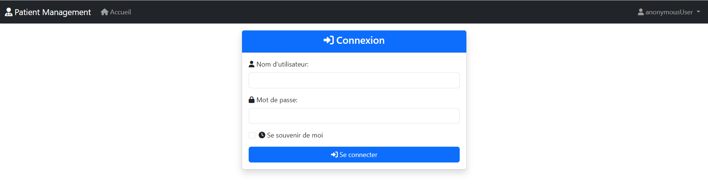
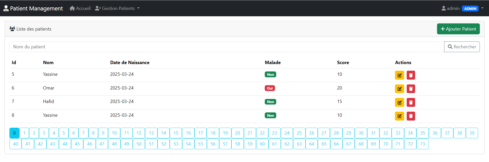
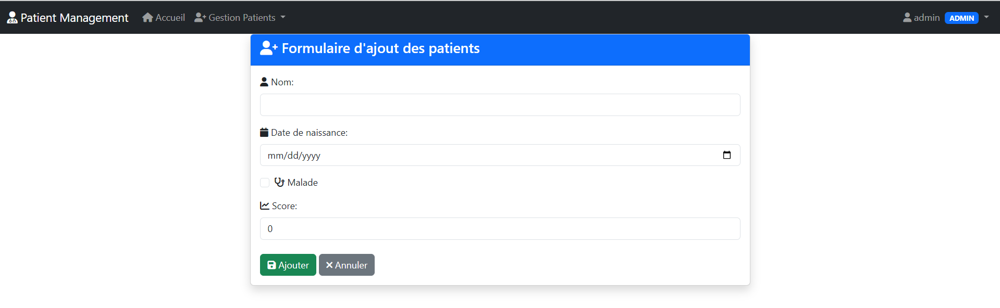
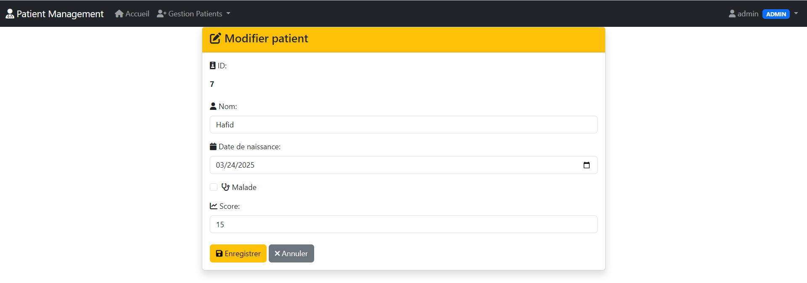
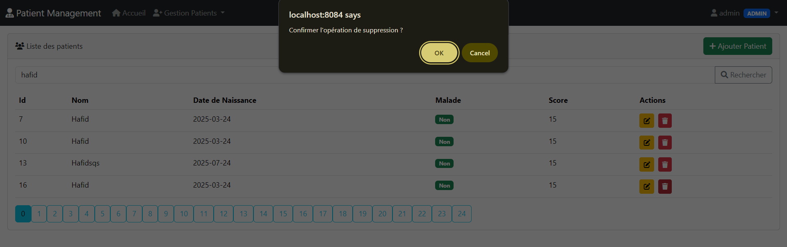
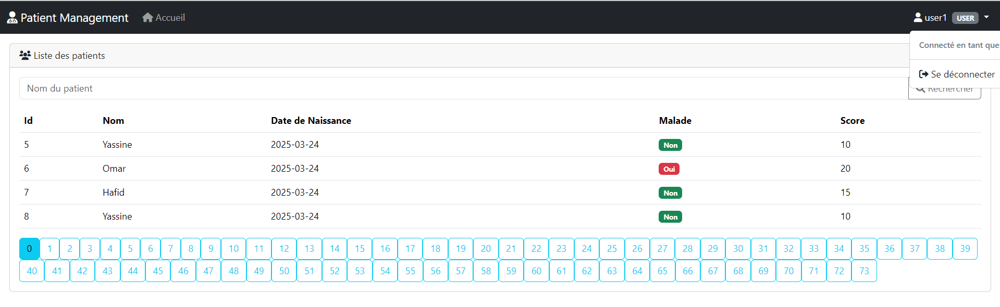

# Application de Gestion des Patients avec Spring Boot

## 📝 Description du Projet

Ceci est un **Système de Gestion des Patients** complet développé avec **Spring Boot**. Il inclut des opérations CRUD complètes, un contrôle d'accès basé sur les rôles, et une authentification sécurisée. L'application démontre les bonnes pratiques de sécurité au niveau entreprise avec Spring Security, l'authentification par base de données, et une interface web moderne utilisant les templates Thymeleaf.

Le système supporte deux types d'utilisateurs :
- **ADMIN** : Accès complet pour créer, lire, modifier et supprimer des patients
- **USER** : Accès en lecture seule pour consulter les informations des patients

## 🛠 Technologies Utilisées

### Backend
- **Spring Boot 3.x**
- **Spring Security 6.x** - Authentification et autorisation
- **Spring Data JPA** - Persistance des données
- **Hibernate** - Framework ORM
- **MySQL** - Base de données
- **BCrypt** - Chiffrement des mots de passe

### Frontend
- **Thymeleaf** - Moteur de templates
- **Bootstrap 5** - Framework CSS
- **HTML5/CSS3**

### Construction et Dépendances
- **Maven** - Gestion des dépendances
- **Java 17+**

## ✨ Fonctionnalités

### 👤 Gestion des Utilisateurs
- **Authentification par Base de Données** - Implémentation personnalisée de UserDetailsService
- **Contrôle d'Accès par Rôles** - Rôles ADMIN et USER
- **Chiffrement des Mots de Passe** - Hachage BCrypt
- **Gestion des Sessions** - Gestion sécurisée des sessions

### 🏥 Gestion des Patients
- **Créer des Patients** - Ajouter de nouveaux dossiers patients (ADMIN uniquement)
- **Consulter les Patients** - Liste paginée des patients (TOUS les utilisateurs)
- **Modifier les Patients** - Éditer les informations existantes (ADMIN uniquement)
- **Supprimer les Patients** - Effacer les dossiers patients (ADMIN uniquement)
- **Recherche et Filtrage** - Trouver des patients selon différents critères

### 🎨 Interface Utilisateur
- **Design Responsif** - Layout responsive basé sur Bootstrap
- **Système de Templates** - Dialecte de layout Thymeleaf pour une UI cohérente
- **Interface basée sur les Rôles** - Contenu dynamique selon les permissions utilisateur
- **Navigation Moderne** - Barre de navigation Bootstrap avec contrôles de sécurité

## 🔐 Implémentation de la Sécurité

### Flux d'Authentification
1. **Connexion Utilisateur** - Authentification basée sur formulaire
2. **Validation des Identifiants** - Recherche en base de données avec vérification BCrypt
3. **Chargement des Autorités** - Attribution des rôles et permissions utilisateur
4. **Création de Session** - Établissement d'une session sécurisée

### Modèle d'Autorisation
- **Sécurité basée sur les URL** :
  - `/user/**` - Accessible aux rôles USER et ADMIN
  - `/admin/**` - Réservé au rôle ADMIN uniquement
  - `/login` - Accès public
  - `/` - Redirige vers le tableau de bord approprié

- **Sécurité au niveau des méthodes** :
  ```java
  @PreAuthorize("hasRole('ADMIN')")
  public String deletePatient(@RequestParam Long id)
  ```


## 📸 Captures d'Écran

### Page de Connexion

*Formulaire de connexion sécurisé avec champs nom d'utilisateur et mot de passe*

### Tableau de Bord Admin - Liste des Patients

*Interface complète de gestion des patients avec toutes les opérations CRUD*

### Admin - Ajouter un Nouveau Patient

*Formulaire pour créer de nouveaux dossiers patients avec validation*

### Admin - Modifier un Patient

*Interface de modification de patient avec champs pré-remplis*

### Admin - Confirmation de Suppression

*Dialogue de confirmation pour la suppression de patient*

### Tableau de Bord Utilisateur - Vue en Lecture Seule

*Interface limitée pour les utilisateurs avec permissions en lecture seule*

## 🔌 Points d'Accès API

### Points d'Accès d'Authentification
| Méthode | URL | Description | Accès |
|---------|-----|-------------|-------|
| GET | `/login` | Page de connexion | Public |
| POST | `/login` | Traitement de la connexion | Public |
| GET | `/logout` | Déconnexion utilisateur | Authentifié |

### Points d'Accès de Gestion des Patients
| Méthode | URL | Description | Accès |
|---------|-----|-------------|-------|
| GET | `/user/index` | Liste des patients | USER, ADMIN |
| GET | `/admin/delete` | Supprimer un patient | ADMIN |
| GET | `/admin/formPatients` | Formulaire nouveau patient | ADMIN |
| POST | `/admin/save` | Sauvegarder un patient | ADMIN |
| GET | `/admin/editPatient` | Formulaire de modification | ADMIN |

### Points d'Accès de Sécurité
| Méthode | URL | Description | Accès |
|---------|-----|-------------|-------|
| GET | `/notAuthorized` | Page d'accès refusé | Authentifié |
